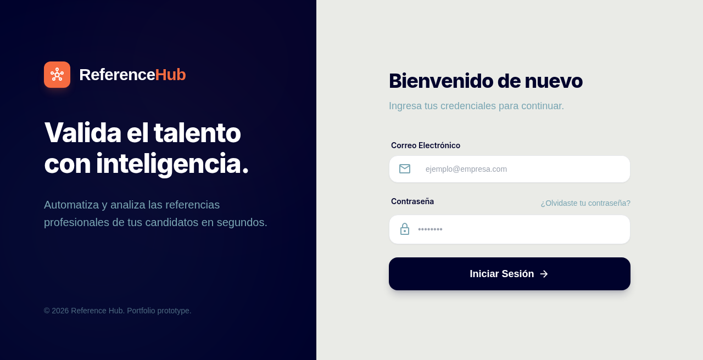

# Reference Hub

**Demo:** https://joshuadh1409.github.io/reference-hub/

Prototipo para gestionar referencias laborales: invitas referentes, recolectas respuestas, puntúas candidatos y generas reportes.

<!-- screenshots -->
## Vista



> La app vive en `ReferenciaAI-Prototipo/frontend` + `backend`.


## Stack

- **Frontend:** React + Vite + Tailwind
- **Backend:** .NET 8 (minimal API) + EF Core + SQLite
- **Extras:** Recharts, QuestPDF, bandeja de correo simulada

## Requisitos

- .NET 8 SDK
- Node.js 18+

## Cómo correrlo

Dos terminales. Si clonaste el repo, el código vive en `ReferenciaAI-Prototipo/`.

**API**

```bash
cd ReferenciaAI-Prototipo/backend
dotnet run
```

Queda en `http://localhost:5155`. Al arrancar crea `referencia_ai.db` con datos de demo.

**Frontend**

```bash
cd ReferenciaAI-Prototipo/frontend
npm install
npm run dev
```

Abre `http://localhost:5173`.

## Qué puedes probar

- Dashboard con avance y semáforo de riesgo
- Expediente de un candidato terminado
- Alta de candidato + invitaciones a referentes
- Bandeja de correos de demo (SMTP opcional)
- Cuestionario público (copia el link de una referencia pendiente)
- Reportes / PDF

## Limitaciones

- El correo puede quedar solo simulado en BD; no subas contraseñas reales a `appsettings.json`
- Los recordatorios son manuales en este prototipo
- Auth multi-tenant completa está fuera de alcance
- Para resetear la demo: para la API y borra `backend/referencia_ai.db`
